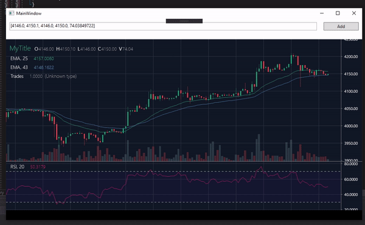

# UndergroundIRO.TradingViewKit

C# binding to TradingView library based on [TradingVue.js](https://github.com/C451/trading-vue-js) and [IRO.XWebView](https://github.com/IT-rolling-out/IRO.XWebView) .

It can work on any browser engine wrapped by IRO.XWebView (now CefSharp, Android.WebView).

Get started with TradingViewContext, which is an analog of Data object in vue project. Just update it and view will be redrawn automatically.

```csharp
    public class TradingViewContext
    {
        public string Title { get; set; } = "";

        public TradingViewChart Chart { get; set; }
    }
	
	public class TradingViewChart
    {
        [JsonProperty("ohlcv")]
        public IList<OhlcvItem> Ohlcv { get; set; }

        [JsonProperty("onchart")]
        public IList<ChartOverlay> OnChart { get; set; }

        [JsonProperty("offchart")]
        public IList<ChartOverlay> OffChart { get; set; }
    }

```

Demo:

